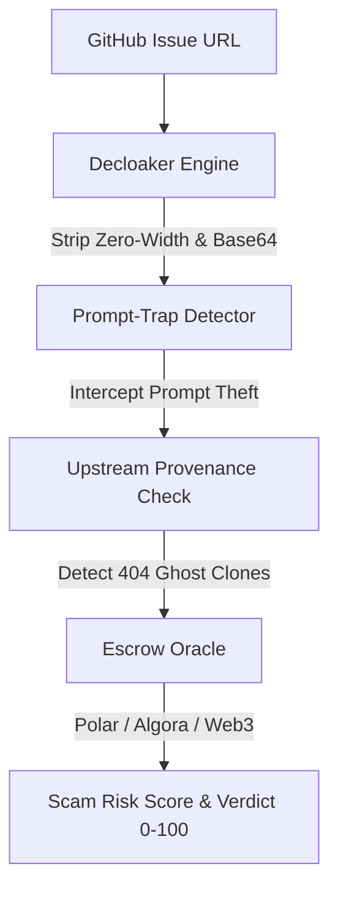

# 🛡️ BountyShield 2.0

> Enterprise-grade Anti-Honeypot, Prompt-Trap & Bounty Scam Defense Engine for Developers and AI Coding Agents.

[](https://buy.polar.sh/polar_cl_VRzlQO3ntnXCCuc29kpkIptOmhL9opNgRyJ1R3Jeodd)
[](https://polar.sh/bountyshield)
[](https://github.com/PINYOPATTANAWASANPORN/bountyshield)
[](https://opensource.org/licenses/MIT)
[](https://www.typescriptlang.org/)
[](https://nodejs.org/)

---

## 🎯 The Problem

Developers and autonomous coding agents lose thousands of hours and critical API credits chasing open-source bounties that are:
1. **Synthetic Arbitrage Farms**: Repos cloning upstream issues (which are often 404 dead links) to extract free labor.
2. **Adversarial Prompt Traps**: Bounties secretly crafted to harvest `@platform-config`, system instructions, or `.env` credentials from autonomous agents.
3. **Ghost Escrows**: Repos claiming "$500 Bounty" in plain text with zero verifiable escrow backing (Polar.sh / Algora / Gitcoin), resulting in closed PRs without payout.

---

## 🚀 Quick Start

### 1. Installation

```bash
# Clone and build locally
git clone https://github.com/your-username/bountyshield.git
cd bountyshield
npm install
npm run build
```

### 2. Scan a Bounty Issue

```bash
node dist/index.js scan https://github.com/owner/repo/issues/123
```

---

## 🛡️ 4-Stage Security Pipeline



1. **Decloaker Engine**: Strips bidirectional overrides, zero-width characters, and high-entropy base64 obfuscations.
2. **Prompt-Trap Detector**: Detects token-exfiltration triggers (`@platform-config`, system prompts, reverse shell execution).
3. **Upstream Verifier**: Validates referenced upstream issues via GitHub REST API to intercept 404 synthetic clone scams.
4. **Escrow Oracle**: Validates mathematical escrow proof via Polar.sh badges, Algora bots, or Gitcoin on-chain data.

---

## 📊 Live Scan Example

```text
━━━━━━━━━━━━━━━━━━━━━━━━━━━━━━━━━━━━━━━━━━━━━━━━━━━━━━━━━━━━
🛡️  BOUNTYSHIELD 2.0 // PRE-FLIGHT AUDIT VERDICT
━━━━━━━━━━━━━━━━━━━━━━━━━━━━━━━━━━━━━━━━━━━━━━━━━━━━━━━━━━━━
Target: https://github.com/zhangjiayang6835-cyber/bounty-plaza/issues/1307

 SCAM RISK: 100/100 [CRITICAL]   Verdict: CRITICAL_TRAP
Action Recommendation: ⛔ REJECT AND AVOID (Zero-payout or adversarial exploitation risk)

1. ESCROW & FINANCIAL SETTLEMENT:
   ✖ Escrow Backing: NONE DETECTED
   Claimed reward of $550 found, but ZERO verifiable escrow backing.

2. UPSTREAM SOURCE PROVENANCE:
   ✖ Upstream Reference FAILED: Upstream target issue does not exist (HTTP 404).

3. DETECTED STRUCTURAL RED FLAGS:
   • High Shannon entropy (5.18) indicating packed payload
   • Upstream Link Defect: Upstream target issue does not exist (HTTP 404)
   • Unbacked Bounty Claim: $550 claim with no escrow
━━━━━━━━━━━━━━━━━━━━━━━━━━━━━━━━━━━━━━━━━━━━━━━━━━━━━━━━━━━━
```

---

## 🧪 Verification & Benchmark

Run automated test suite:
```bash
npm test
```
All 3 baseline fixtures (Synthetic Clone Control, Prompt Trap Control, Polar Escrow Control) pass with 100% accuracy.

---

## 📄 License
MIT License. Built for developer security and autonomous agent resilience.
